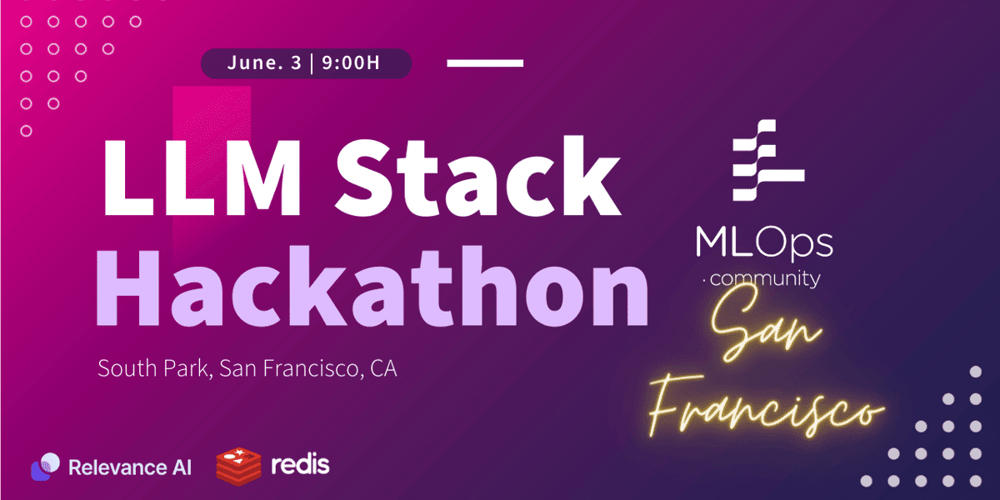

# MLOps.community SF LLM Stack Hackathon



### The Competition Tracks

**​Track 1:** Q&A using Community Expertise - Answer questions using the #mlops-questions-answered and #discussions channels.

**​Track 2:** Community Insights - Generate interesting insights and unique perspectives

**Data Source:** [MLOps Community Slack converesations](https://drive.google.com/drive/folders/1FCuU2j8yI7hXsZL8Ls_fgJwUn7-Dx_VV). There are preprocessed embedding files that we are not persisting in the repository.

## Setup

We use Redis as the vector store. Redis Cloud free plan only have 30MB, which is not large enough for the dataset we have.

To run it locally, please do:
```bash
docker run -d --name redis-stack -p 6379:6379 -p 8001:8001 redis/redis-stack:latest
```

To access the Redis cli, please do
```bash
docker exec -it redis-stack redis-cli
``` 

To setup the python environment
```bash
poetry install
poetry shell
```
## Indexing

We use the pre-calculated embeddings generously provided by the hackathon host. The embeddings are indexed into Vector Store in [this notebook](./notebooks/0.0.1-sample-LLM-Stack-Hackathon-Starter.ipynb).

The index name is 'vector_index'.

In production setting, indexing operations will be codified and managed in some code base.
